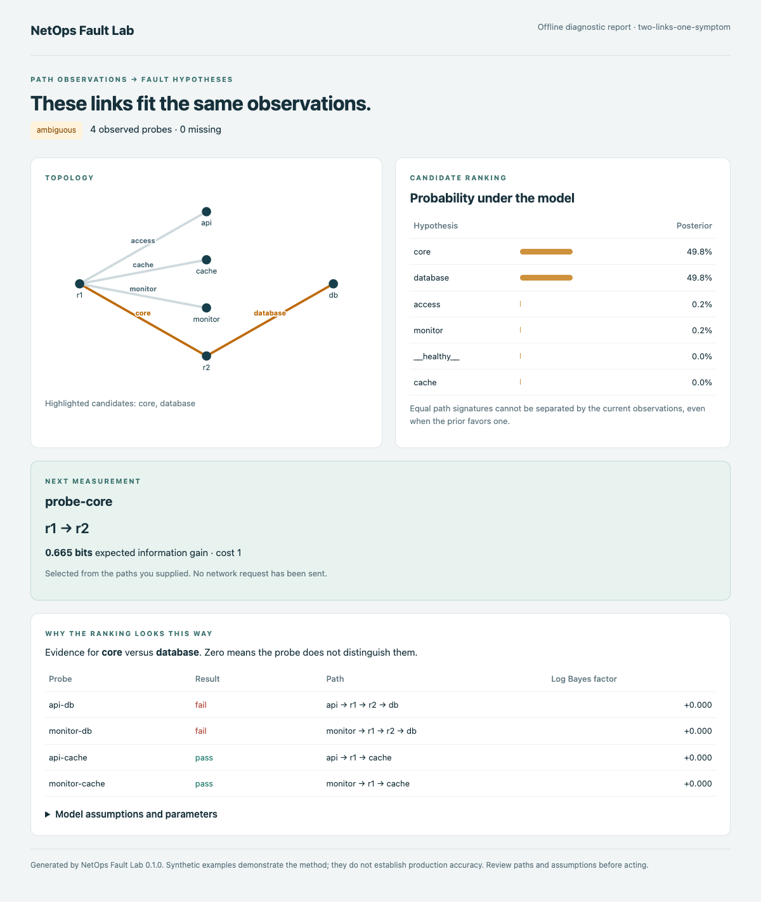
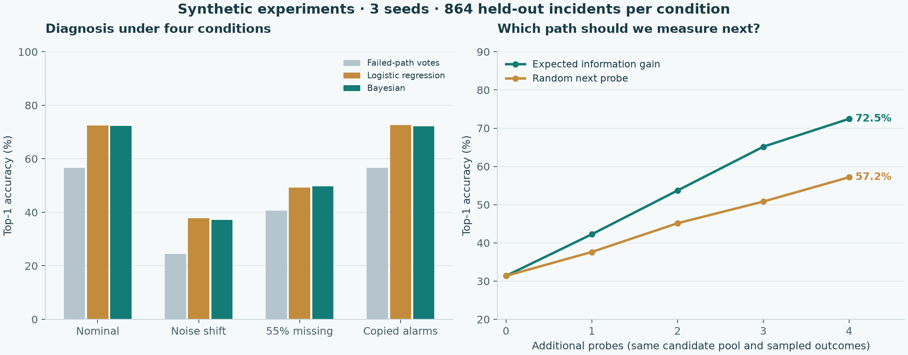

# NetOps Fault Lab

Rank likely faulty links from path probes, then choose what to measure next.

[](https://github.com/chrischen-coder/netops-fault-lab/actions/workflows/ci.yml)
[Python 3.10+](pyproject.toml) · [MIT license](LICENSE)

[简体中文](README.zh-CN.md) · [Method](docs/method.md) · [Experiments](docs/experiments.md) · [Input format](docs/input.md)

Two paths to a database fail; paths to a cache pass. Both the core link and the
database access link explain the observations. Counting failures cannot separate
them, and copies of the same alarms add no independent evidence.

This tool ranks fault hypotheses, flags links that the observations cannot
distinguish, and recommends the next useful path probe. It reads structured JSON
and produces text, JSON or an offline HTML report.



The synthetic example starts with two candidates at 49.8% each. Adding one failed
`r1 → r2` probe raises the core link's model probability to 96.7%. That outcome is
scripted to demonstrate inference; no real network was probed. [After the extra probe](docs/assets/after-probe.png).

## Quick start

Python 3.10+:

```bash
git clone https://github.com/chrischen-coder/netops-fault-lab.git
cd netops-fault-lab
python -m venv .venv
```

Activate with `source .venv/bin/activate` on macOS/Linux or `.venv\Scripts\Activate.ps1` in Windows PowerShell.

```bash
python -m pip install .
netops-fault-lab diagnose examples/ambiguous.json
netops-fault-lab diagnose examples/after-probe.json
netops-fault-lab diagnose examples/ambiguous.json --format html --output report.html
```

Key output from the first command:

```text
Status: ambiguous
core                 0.498
database             0.498
Indistinguishable: core, database
Next probe: probe-core (r1 -> r2); expected gain 0.665 bits
```

Open `report.html` to inspect the paths, ranking and evidence. Output files must
not already exist. Core inference uses only the Python standard library.
Without `--model`, the parameters are illustrative defaults, not field calibration.

## What this addresses

| Problem | Current behavior |
| --- | --- |
| One bad link causes several failed paths | Use both passed and failed probes to rank hypotheses |
| Different faults produce the same observations | Report their shared path signature instead of presenting a unique diagnosis |
| Additional measurements have a cost | Rank supplied probes by expected information gain per cost |
| Average accuracy hides failures | Keep separate noise-shift, missing-data and copied-alarm results with per-case records |

## Method and learning

Assume at most one faulty link in the observation window:

```text
posterior ∝ prior × likelihood of the observed probe outcomes
next probe = highest expected uncertainty reduction / cost
```

The affected-path failure rate, background failure rate and healthy prior are
estimated from labeled training data with Beta(1,1) smoothing. Baselines include
failed-path voting, fitted logistic regression and Bayesian inference on the same splits.

These are established statistical methods. The project focuses on reproducible
diagnosis and probe-selection experiments, identifiability and failure analysis.
[Equations, assumptions and related work](docs/method.md).

## Measured results

Three seeds; each uses 24 training and 24 distinct test topologies, with 12
incidents per topology. Each condition contains **864 synthetic test incidents**.

| Condition | Failed-path votes Top-1 | Logistic Top-1 | Bayesian Top-1 |
| --- | ---: | ---: | ---: |
| Matched noise | 56.6% | 72.5% | 72.3% |
| Increased background failures, weaker fault signal | 24.4% | 37.7% | 37.2% |
| 55% missing probes | 40.6% | 49.3% | 49.7% |
| Same alarms copied four times | 56.6% | 72.6% | 72.1% |

Bayesian ranking does not clearly beat logistic regression. In a separate active
experiment starting with three probe records and allowing four more measurements,
**information-gain selection reaches 72.5%, versus 57.2% for random selection**.
Both policies share the candidate pool and sampled outcomes. The observed difference
is 15.3 percentage points; a paired topology bootstrap gives a 95% interval of 11.8–18.5 points.



Confidence also fails: copying alarms increases the error rate among accepted
diagnoses from 2.6% to 12.6%; under noise shift it reaches 38.2%. A `0.9` decision
threshold does not guarantee 90% correctness.

These simulations test method behavior, not production accuracy or recovery time.
[Datasets, per-case predictions, learned parameters and protocol](docs/experiments.md).

## Reproduce

```bash
python -m pip install '.[bench]'
netops-fault-lab benchmark --output runs/local
netops-fault-lab fit benchmarks/results/v0.1/train-7.jsonl.gz --output fitted-model.json
netops-fault-lab diagnose examples/ambiguous.json --model fitted-model.json
python -m unittest discover -s tests -v
```

Choose a new output directory. The benchmark saves data, topology splits, fitted
parameters, per-case predictions and active-probe traces.

## Scope

Known static paths, a healthy network or one failed link, and conditionally
independent outcomes. Changing routes, simultaneous failures, correlated alarms,
application faults and parameter drift need additional modeling. A posterior
ranking is not proof of the physical root cause.

This release is an offline algorithm and experiment tool. Next: controlled
network measurements, correlated-noise and multiple-fault models. The planned
log-text and topology-image accuracy experiments are not implemented. [Roadmap](docs/roadmap.zh-CN.md).

The optional [GPU setup and smoke checks](experiments/gpu/README.md) have been run
on eight RTX 5090 GPUs: DDP synchronization, local Qwen3-VL image inference and
single-GPU LoRA updates. These checks validate the environment, not diagnosis accuracy.

[Contributing](CONTRIBUTING.md) · [Changelog](CHANGELOG.md) · [Software citation](CITATION.cff)

MIT licensed. All bundled examples and experimental data are generated for this project.
